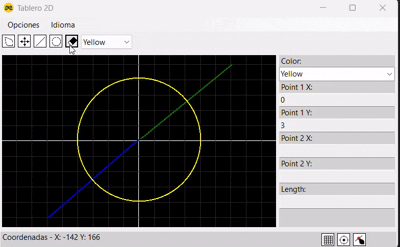

# Prototipo CAD en C# con Canvas

Este proyecto es un **prototipo de aplicación CAD** desarrollado desde cero en **C#** utilizando **Canvas**. El objetivo es crear una plataforma sencilla para la **creación y edición de dibujos 2D** con funcionalidades personalizadas como la **selección de idioma**, **borrado dinámico**, **visualización por coordenadas** y mucho más.

Este prototipo pone énfasis en la organización eficiente y la **interactividad** del usuario, con una interfaz fluida y herramientas intuitivas.


## Características

### **Selección de Lenguaje**
- Soporte **multilingüe** que permite mostrar la interfaz en **español e inglés**. Esto se gestiona mediante archivos `.resx`, garantizando la accesibilidad a una audiencia más amplia y la posibilidad de agregar otros idiomas en el futuro.

### **Herramientas de Dibujo: Líneas y Círculos**
- Permite crear **líneas** y **círculos** de forma rápida y sencilla con opciones de **color dinámicas** para cada figura.
  - **Dibujo de Líneas:** Crea líneas con diferentes configuraciones de color.
  - **Dibujo de Círculos:** Similar al dibujo de líneas, pero con opciones para ajustar el **radio** y el **color** de los círculos.
  - **Selección de Color:** Cada figura puede cambiar de color desde un menú de opciones.
  


### **Propiedades Dinámicas**
- Los **atributos de las líneas** y **círculos** se pueden modificar **en tiempo real**. Solo basta con seleccionar el objeto y sus propiedades se actualizan inmediatamente (color, grosor de línea, etc.), lo que facilita el diseño sin pasos adicionales.


### **Borrado Dinámico**
- La herramienta de **borrado recortado** elimina solo los objetos seleccionados al pasar sobre ellos. Esto mejora la experiencia de edición en tiempo real, permitiendo borrar de manera sencilla y precisa.
  


### **Visualización por Coordenadas**
- Se muestra una **guía de coordenadas** en la pantalla que ayuda a los usuarios a crear y mover objetos con precisión, garantizando que las figuras estén correctamente alineadas.

### **Funciones Beta**
- Algunas funciones experimentales están en desarrollo:
  - **Snap to Point:** Ajusta el dibujo al punto más cercano mientras el mouse se mueve (por ejemplo, extremos o el centro de las figuras).
  - **Grid (Rejilla):** Activa una cuadrícula visual para facilitar el dibujo de líneas y figuras con precisión.
  - **Regresar al Centro:** Centra el lienzo automáticamente en la pantalla para mejorar la visibilidad del área de trabajo.


### **Futuras Mejoras**
- **Transición de 2D a 3D:** Se planea agregar la capacidad de visualizar objetos en 3D (al menos de manera no editable), comenzando con círculos en un entorno tridimensional.
- **Acotación:** Se pretende permitir la medición de los objetos dibujados, una característica fundamental para un software CAD completo.
- **Mejoras en Snap to Grid:** Actualmente en fase beta, se mejorará la precisión del ajuste al grid para ser más útil en planos complejos.

## Tecnologías
Este proyecto utiliza las siguientes tecnologías clave:

- **C#**: Lenguaje principal utilizado para el desarrollo de la aplicación.
- **Canvas**: Para la creación y renderizado de los elementos gráficos (líneas, círculos) en la interfaz.
- **Resx**: Para la internacionalización y la creación de interfaces multilingües.
- **WinForms**: Para la interfaz de usuario, utilizando controles estándar de Windows.

## Instalación

Para comenzar a usar este proyecto en tu entorno local, sigue estos pasos:

1. **Clona este repositorio:**
   ```bash
   git clone https://github.com/jegarcia2/2dboard.git
   
2. **Construye el proyecto:** 
  Asegúrate de tener .NET 9.X o superior instalado.

3. **Ejecuta el proyecto:**
  Una vez que hayas clonado y construido el proyecto, puedes ejecutarlo con el siguiente comando:
   ```bash
   dotnet run
